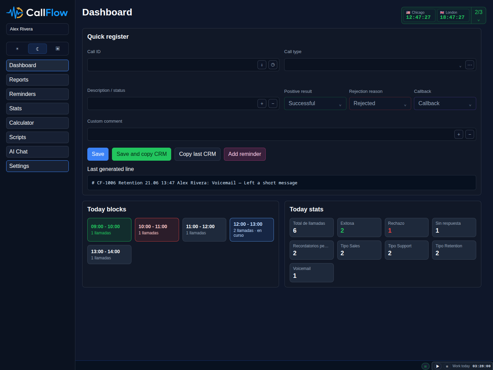
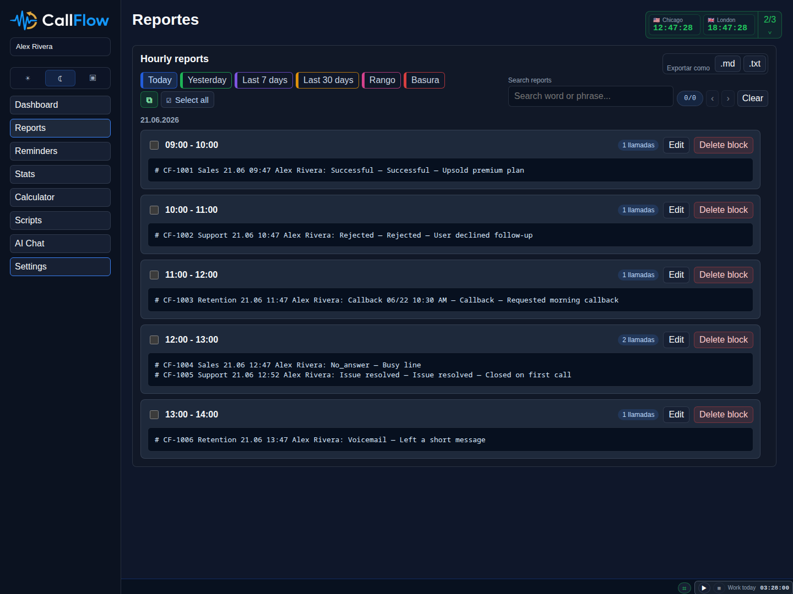
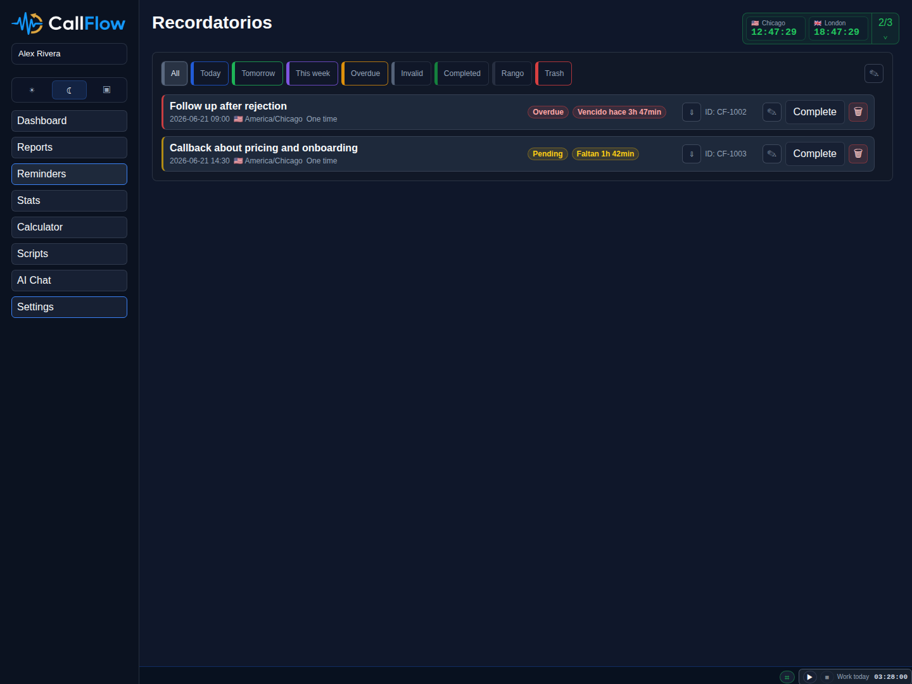
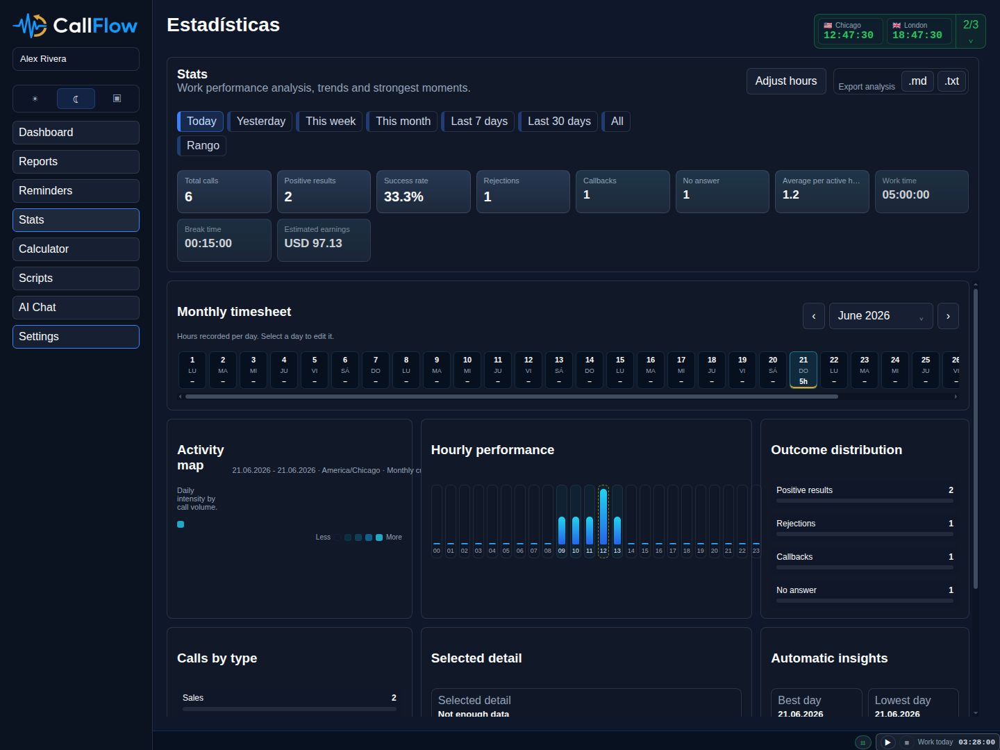
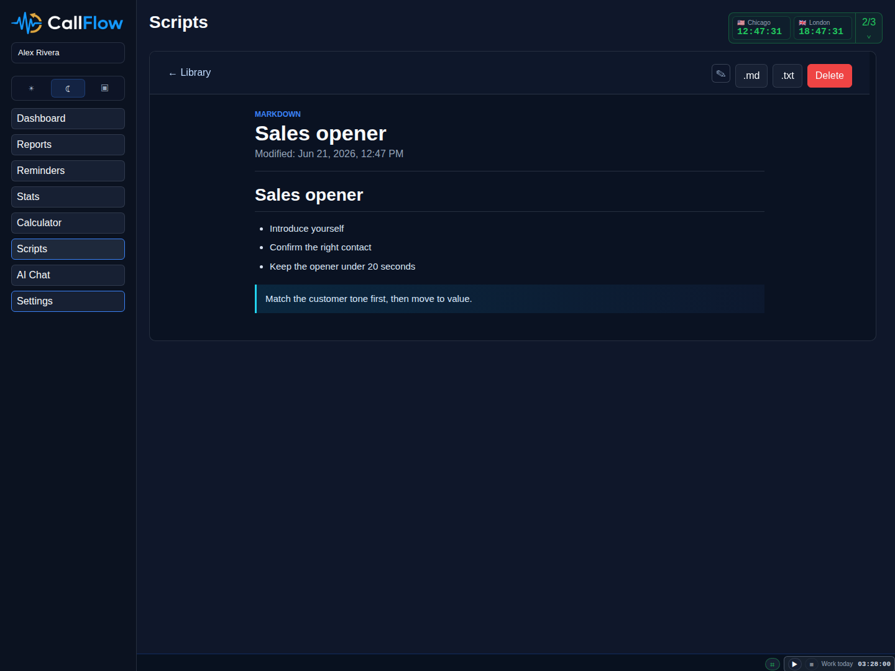
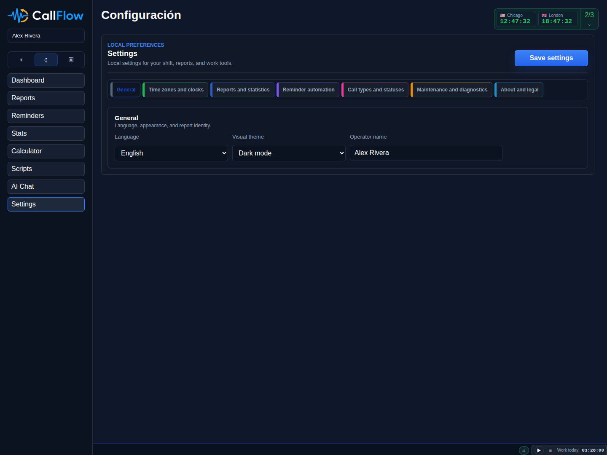
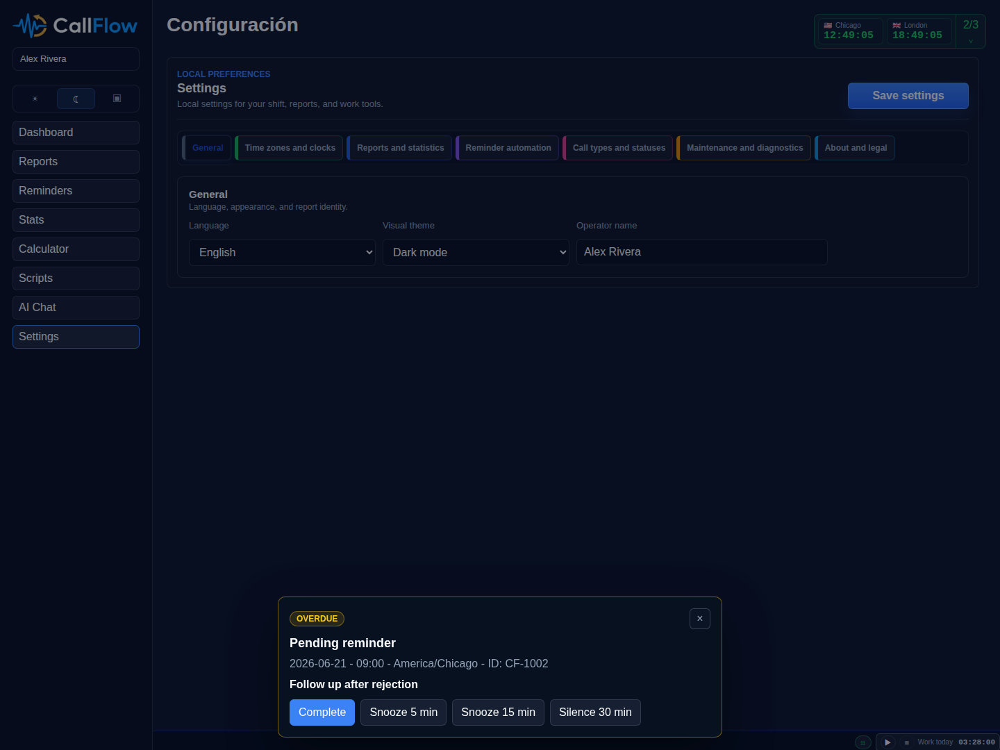
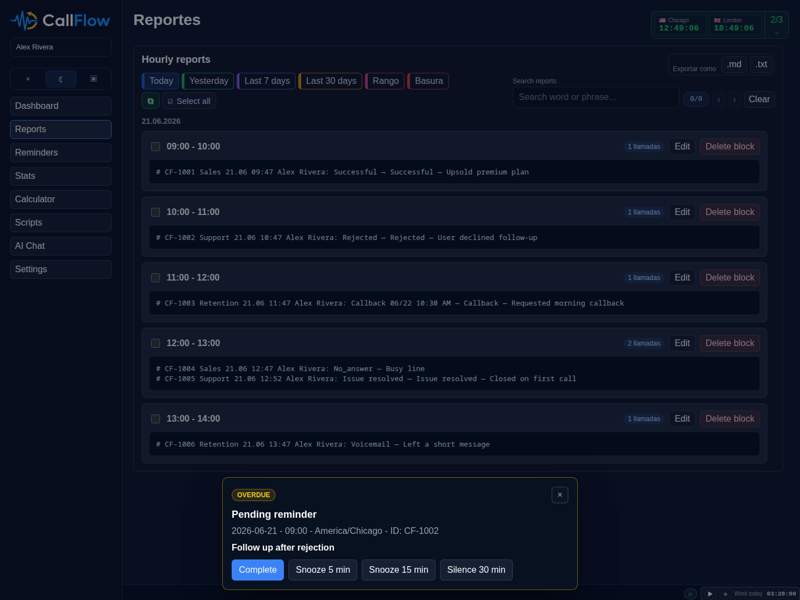
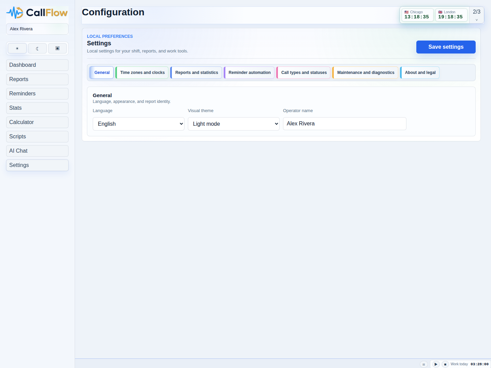

# CallFlow


CallFlow is a local-first Electron desktop beta app for call-center operators. It helps agents register calls quickly, copy CRM-ready lines, generate hourly supervisor reports, manage callbacks and reminders, keep shift timers and multizone clocks visible, and maintain a Markdown script library without requiring a backend.

The project is intentionally compact and honest: it shows the product state as it exists today, not the features planned for a later release.

CallFlow is currently in beta. Core local workflows are functional, the Windows installer builds successfully, and active testing is being performed on Windows 11. Some UX, documentation, legal text, and release polish are still being refined.

## Windows download

> **Download for Windows**
>
> [](https://github.com/GaboEI/callflow/releases/download/v0.2.0-beta.1/CallFlow.Setup.0.2.0-beta.1.exe)
>
> [](https://github.com/GaboEI/callflow/releases/tag/v0.2.0-beta.1)
>
> **Status:** The current Windows beta installer is available from GitHub Releases. Version 0.2.0-beta.1 is an NSIS installer validated on Windows 11. This is a beta release, not a stable enterprise build. The installer is currently unsigned — Windows SmartScreen may show a warning on first run.

## Screenshots

### Dark mode

| Dashboard | Reports | Reminders |
| --- | --- | --- |
|  |  |  |
| Stats | Scripts | Settings |
|  |  |  |

### Light mode

These screenshots show the app in a light theme state.

| Dashboard | Reports | Settings |
| --- | --- | --- |
|  |  |  |

## What CallFlow does today

- Fast call registration with optional call type, frequent status, custom comment, and primary outcome.
- CRM copy and supervisor report lines generated from the same stored call record.
- Hourly report browsing, in-report search, block editing, and block deletion.
- Callback reminders with pending, overdue, completed, deleted, snooze, mute, and recurrence states.
- Local statistics for total calls, outcomes, hourly activity, reminders, timesheets, work timers, break time, and estimated earnings.
- Multi-timezone clocks, pinned clocks, and local work/break tracking.
- Internal Markdown script library with safe rendering, search, pinning, import/export, and plain-text/PDF-aware document handling.
- Maintenance actions for controlled local-data reset and safe backup/import workflows.
- Onboarding and settings for language, time zone, report formatting, reminder behavior, call labels, theme, and finance settings.
- Local data export/import and diagnostics.
- Explicit legal review in onboarding, with accepted terms stored locally and surfaced in About.
- An AI Chat shell is present in the UI, but it is currently a placeholder and does not connect to a live AI service yet.

## Who it is for

- Call-center agents who need to log calls quickly during live shifts.
- Team leads who need hourly or block-based reports.
- Supervisors who want a fast local tool instead of a browser-only workflow.
- Technical recruiters or reviewers who want a real desktop product with clear architecture, privacy boundaries, and a visible implementation footprint.

## Why it exists

CallFlow was built to reduce friction around repetitive call-center work:

- one place to register calls,
- one place to copy CRM-ready lines,
- one place to track reminders and callbacks,
- one place to see shift time, time zones, and daily performance,
- one place to keep scripts and internal notes.

The app is optimized for a compact side-by-side workflow next to CRM, Telegram, or another operator tool.

## Tech Stack

- Electron
- HTML
- CSS
- JavaScript
- Node.js
- Local JSON persistence
- Safe Markdown rendering with DOMPurify + EasyMDE assets bundled locally

There is no React, Vue, Angular, backend service, or cloud database in the current MVP.

## Architecture

- `src/main/main.js` owns the Electron window, IPC, notifications, clipboard access, import/export dialogs, and reminder scheduling.
- `src/main/storage-service.js` reads and writes versioned JSON data under Electron `app.getPath("userData")`, creates backups, and recovers from corrupt JSON.
- `src/shared/` contains the domain logic used by both the main and renderer processes, including normalization, reminders, reports, stats, outcomes, and validation.
- `src/renderer/scripts/app.js` is the orchestration layer that wires views, shared state, settings, and global events together.
- `src/renderer/scripts/views/` contains the feature modules for dashboard, reports, reminders, stats, scripts, settings, AI shell, calculator, and clock UI.
- The renderer uses `contextIsolation: true` and a minimal preload bridge instead of direct Node access.

See also:

- [Architecture notes](docs/02_architecture.md)
- [Product spec](docs/01_product_spec.md)
- [Windows QA checklist](docs/windows-qa.md)

## Persistent local data

CallFlow stores user data locally inside Electron's `userData` folder. The current storage files are:

- `settings.json`
- `calls.json`
- `templates.json`
- `reminders.json`
- `knowledge_base.json`
- `work_timer.json`

The app also creates local backups and logs under the same user data folder. Nothing here is designed to depend on a remote database.

## Privacy and offline posture

- No cloud sync.
- No backend server.
- No telemetry pipeline in the current MVP.
- No data is sent to an external service by default for the implemented features.
- The AI Chat area is a placeholder, so it does not currently transmit data to a model provider from the app.

The user is responsible for what they store, import, copy, export, or share from the app.

## System requirements

Development:

- Node.js 22.12 or newer
- npm
- Electron dependencies installed with `npm install`
- Linux development has been exercised in this workspace; Windows remains the target packaging platform

Runtime / packaging target:

- Windows 10 or Windows 11 for the `.exe` build path

## Development

Install dependencies:

```bash
npm install
```

Run the app locally:

```bash
npm run dev
```

The same command alias is also available as:

```bash
npm start
```

Validate syntax and tests:

```bash
npm run check
npm test
npm run validate
```

## Product landing page

The repository includes a static product presentation page under `website/`. It is separate from the Electron app and can be opened directly in a browser:

```bash
xdg-open website/index.html
```

You can also serve the folder with any local static server if needed. The page uses local assets from `website/assets/` and describes the current beta feature set without adding a backend or web app runtime.

## Windows packaging

The repository already includes Electron Builder packaging scripts for Windows:

```bash
npm run pack:win
npm run dist:win
npm run dist:win:portable
npm run dist:win:ia32
npm run dist:win:portable:ia32
npm run dist:win:all
```

These targets are configured for Windows packaging. `dist:win` is the primary x64 installer path. The `ia32` targets are prepared for evaluation and should only be advertised as supported if Windows validation passes on real 32-bit builds.

## Download Windows installer

The current Windows beta installer is available from [GitHub Releases](https://github.com/GaboEI/callflow/releases/tag/v0.2.0-beta.1).

- **Version:** 0.2.0-beta.1
- **Installer:** NSIS `.exe` (x64)
- **Status:** beta, validated on Windows 11
- **Signing:** currently unsigned — Windows SmartScreen may show a warning until official code signing is configured

This is not a stable enterprise release yet. See [release notes](docs/releases/v0.2.0-beta.1.md) for details.

## Project status

Current version: `0.2.0-beta.1`

What is implemented now:

- onboarding and settings
- fast call logging
- CRM copy output
- hourly supervisor reports
- reminder creation and notification flow
- daily statistics and timesheets
- work and break timers
- Markdown script library
- diagnostics, export, and import flows
- local backups and data recovery helpers
- controlled local-data erase and restart flow from Settings
- explicit onboarding legal disclosure, blocking, and acceptance metadata
- Windows NSIS and portable packaging paths that have been validated on a Windows 11 VM

What is still not a finished product surface:

- AI Chat is still a placeholder
- cloud sync is not implemented
- a backend server is not part of the MVP
- installer beta terms are included for v0.2.0-beta.1; privacy and terms drafts remain under review before any stable public release

## Repository layout

```text
src/
  main/       Electron main process, storage, logging, preload
  renderer/   UI, screens, styles, client-side orchestration
  shared/     validation, normalization, reports, reminders, stats
src/data/     default app configuration
build/        App icons and packaging assets
docs/         Product notes, architecture, legal drafts, QA
scripts/      Build and validation helpers
```

## Documentation and legal files

- [Roadmap to v1.0 Stable](docs/roadmap/v1.0-stable.md)
- [Case study](docs/00_case_study.md)
- [v1.0.0 release notes (draft)](docs/releases/v1.0.0.md)
- [v1.0.0 Windows QA (template)](docs/qa/windows-qa-results-v1.0.0.md)
- [Windows QA results (v0.2.0-beta.1)](docs/qa/windows-qa-results-v0.2.0-beta.1.md)
- [Windows QA results (v0.1.16)](docs/qa/windows-qa-results-v0.1.16.md)
- [Beta release notes](docs/releases/v0.2.0-beta.1.md)
- [Previous alpha release notes](docs/releases/v0.1.16-alpha.md)
- [Windows QA checklist](docs/windows-qa.md)
- [Changelog](CHANGELOG.md)
- [Contributing](CONTRIBUTING.md)
- [Repository setup](docs/repository-setup.md)
- [Privacy draft](docs/legal/PRIVACY_DRAFT.md)
- [Terms draft](docs/legal/TERMS_DRAFT.md)
- [Legal notes](docs/legal/README.md)

## What this project demonstrates

- A real Electron app with a strict split between main and renderer processes.
- Local-first product thinking for sensitive call-center workflows.
- Domain logic extracted into reusable shared modules instead of being buried in the UI.
- A strong focus on privacy, offline behavior, and explicit local persistence.
- A compact but intentional UI with multiple workflow surfaces in one desktop shell.
- An implementation that is testable, validated, and packaged with Windows in mind.

## Roadmap to 1.0 Stable

CallFlow `v0.2.0-beta.1` is the frozen Official Beta baseline. No new beta features will be added except critical hotfixes.

Work toward `v1.0.0` will focus on visual polish, AI engine implementation, final QA, and stable release documentation. See [Roadmap to v1.0 Stable](docs/roadmap/v1.0-stable.md) for scope, versioning plan, and exit criteria.

## Limitations

- This is still a beta-stage desktop app, not a full enterprise call-center platform.
- No cloud features are available.
- The AI surface is only a placeholder.
- Installer beta terms are included for v0.2.0-beta.1. Privacy and terms drafts remain under review before any stable public release.

## En español

CallFlow es una app de escritorio local en etapa beta para centros de llamadas. Sirve para registrar llamadas rápido, copiar líneas para CRM, generar reportes horarios, administrar recordatorios, ver estadísticas y mantener scripts internos en Markdown. Todo se guarda localmente en el equipo, sin backend ni sincronización en la nube.

Estado actual:

- el registro de llamadas, reportes, recordatorios, estadísticas, reloj multizona y biblioteca de scripts ya están implementados
- Chat IA existe solo como una sección de interfaz, no como un asistente conectado
- los datos se guardan en el perfil local de Electron
- el objetivo principal sigue siendo el empaquetado y pulido para Windows beta

## License

This repository is licensed under [Apache 2.0](LICENSE).

The npm package is marked as `"private": true` in `package.json` to prevent accidental publishing to the npm registry. The source code itself is fully open under the Apache 2.0 license.
